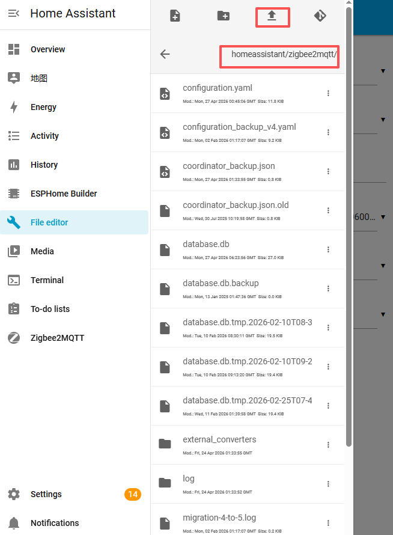
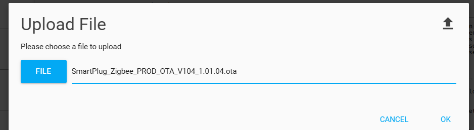
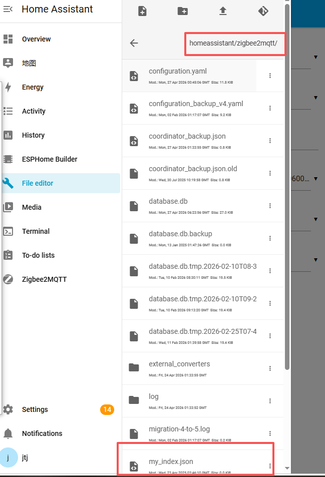
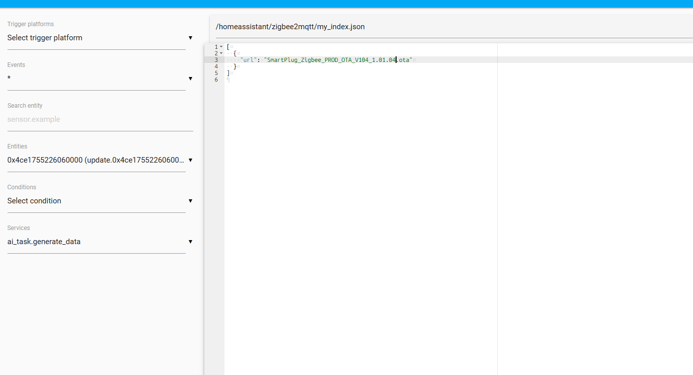
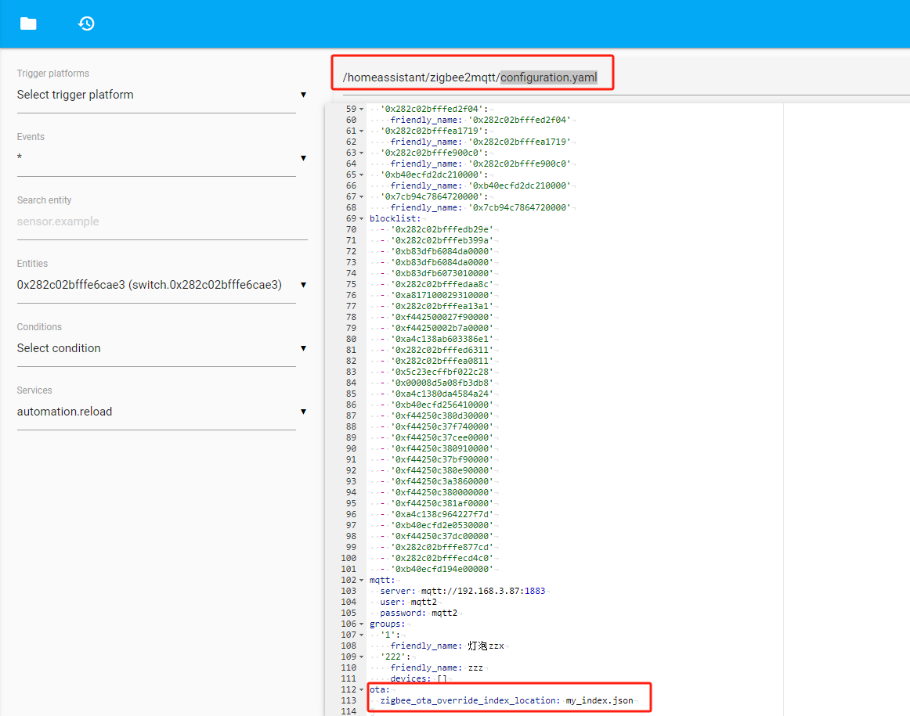

# Local OTA in zigbee2mqtt
## The following devices are only used as examples, and their methods are universal for other devices

1）Download the. ota file you need

2）Use File editor or other tools to upload OTA files in the/homeassistant/zigbee2mqtt directory

2）Create a new JSON file in the same directory, such as my_index.json

3）Click my_indexjson to edit, write the uploaded OTA file name into the json file, and save it

4）In the same directory, configure the my_index. json file in configuration.yaml (add the code below at the end), and click save

5）Restart Z2M to start local OTA

