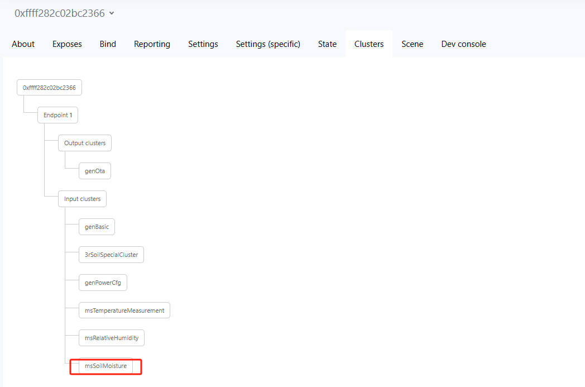

# Regarding Soil Moisture
### Only applicable to soil sensor v1.00.47!!!!
If it is an upgraded soil sensor from OTA, you need to reset the device and re match it. Until the appearance of msSoilMoisture, soil moisture can only be used normally

1）Download the soil.js

2）Place soil.js

3）Restart z2m

