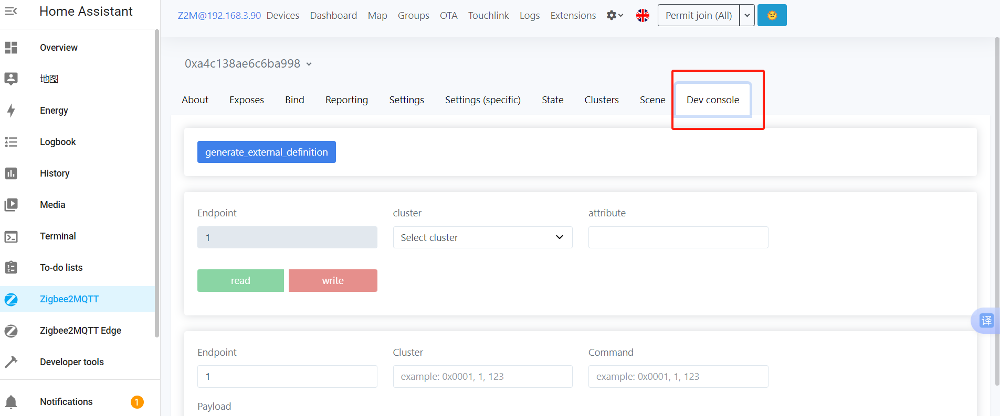
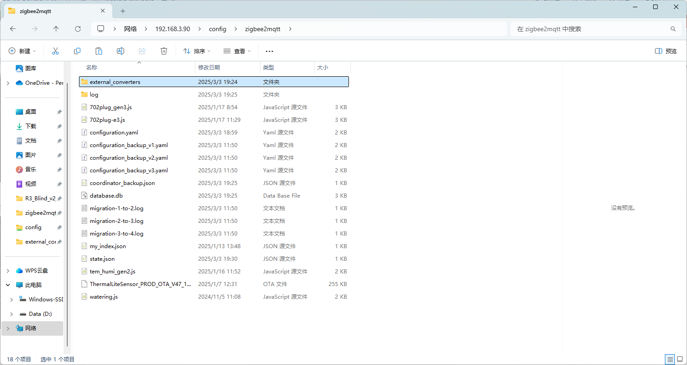
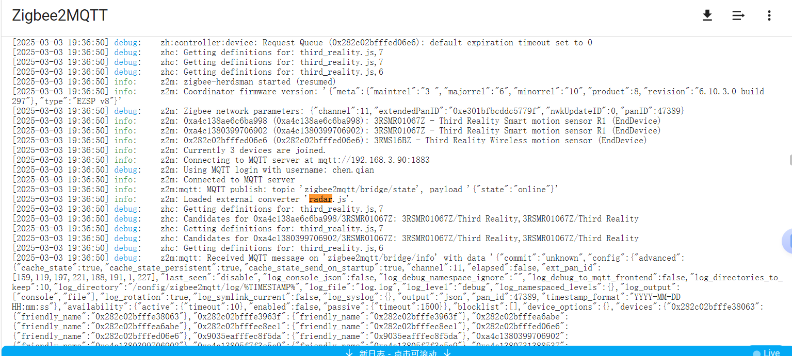

# Instructions on radar Sensor Private Cluster in zigbee2mqtt(local setting)

## Local setting of cooldown time 

1）Place the radar.js File: a. Use the Samba share tool to transfer the radar.js file into a new subfolder called "external_converters" in your zigbee2mqtt folder

2）Restart Z2M

