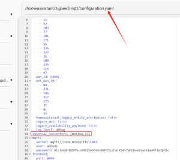
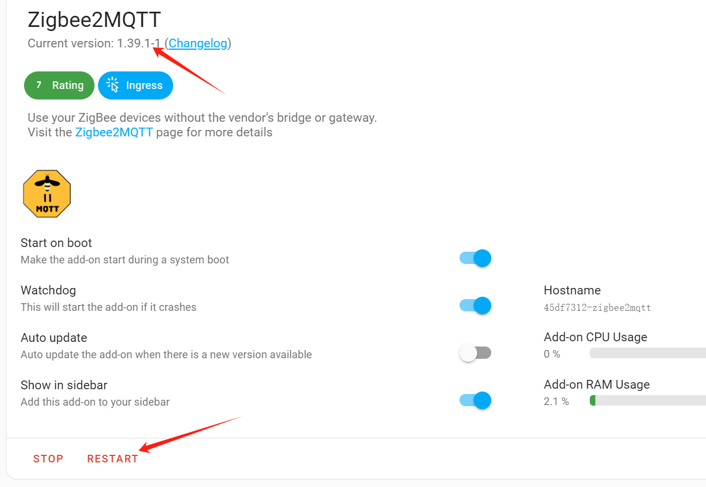
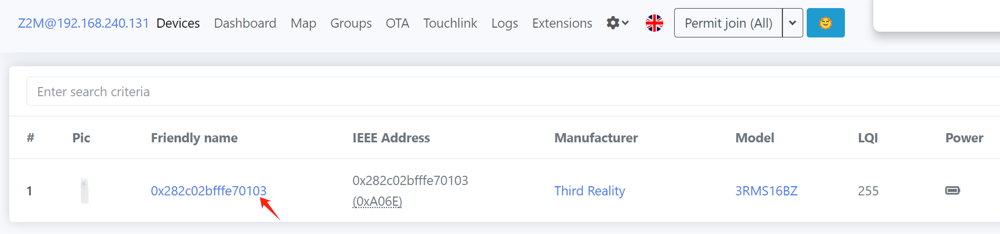
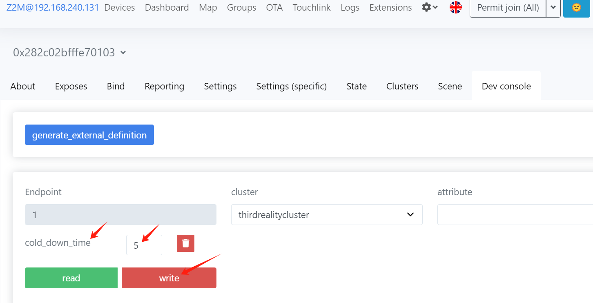

# Instructions on Motion Sensor Private Cluster in zigbee2mqtt(local setting)

## Local setting of cooldown time 

1）in zigbee2mqtt folder : Add the statements in the box in the configuration file configuration.yaml .

2）Place the motion.js File: a. Use the Samba share tool to transfer the motion.js file into the zigbee2mqtt folder.

3）Restart zigbee2mqtt: a. Restart zigbee2mqtt to apply the configuration changes.(ps,The version of Zigbee2MQTT must be after 1.38. )

## Set the "cooldown time" parameter （detected_to_undetected_delay）

Note: These instructions describe the operation for a MOTION SENSOR device. Similar methods can be applied to customize other ThirdReaity devices with private clusters.

1.Add a MOTION SENSOR Device

2.Access MOTION SENSORDevice Settings, navigate to the details page of the added MOTION SENSORdevice, click the "Dev console" button, as shown in the screenshot

3. In cluster, choose the "thirdrealitycluster" option.
   

4. In attribute, choose the "cold_down_time" option.
   

5. click the "read" button,Can read the value of the current setting.

6. click the "write" button,Can set cooldown time, The range of the setting value is 0 - 3600 seconds. if cooldown time is 5 seconds,like as :
   

