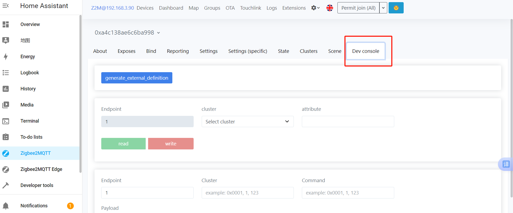
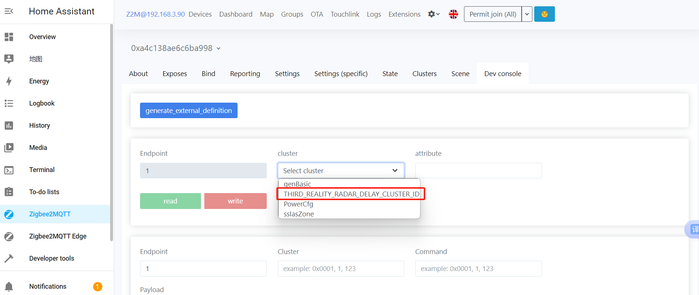

# Instructions for using a private cluster

### Set the "cooldown time" parameter （detected_to_undetected_delay）

1）Add a Smart Motion Sensor R1 Device

2）Access Motion Sensor R1 Device Settings, navigate to the details page of the added Motion Sensor R1 device, click the "Dev console" button, as shown in the screenshot

3）In cluster, choose the "THIRD_REALITY_RADAR_DELAY_CLUSTER_LD" option.

4）In attribute, choose the "cold_down_time" option.

5）click the "read" button,Can read the value of the current setting.
6）click the "write" button,Can set cooldown time, The range of the setting value is 0 - 3600 seconds. if cooldown time is 5 seconds,like as :
