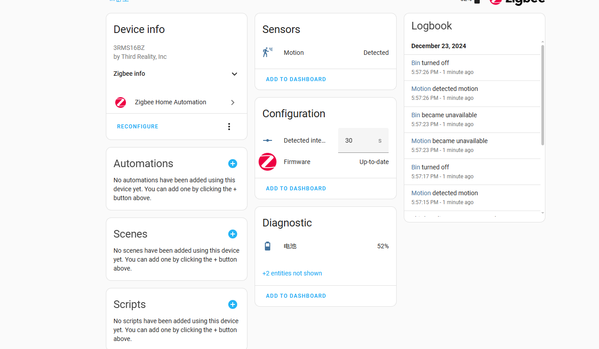
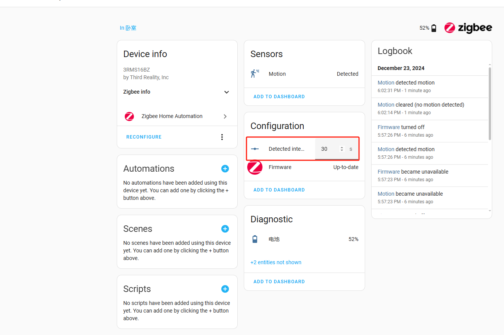

# Instructions on ThirdReality Motion Sensor Private Cluster in Home Assistant ZHA
at least Home Assistant Core is 2024.12.2

#

## 1.Operating Devices(The device is reset, and all private property Settings are restored to default values)

1) Add a MOTION SENSOR Device

2) Access MOTION SENSOR Device Settings, navigate to the details page of the added MOTION SENSOR device

3) Set detected interval(0-3600 second)

4) eg.If you set detected interval is 60(the unit is seconds),from the moment it was triggered, the state of detected will last for 60s

