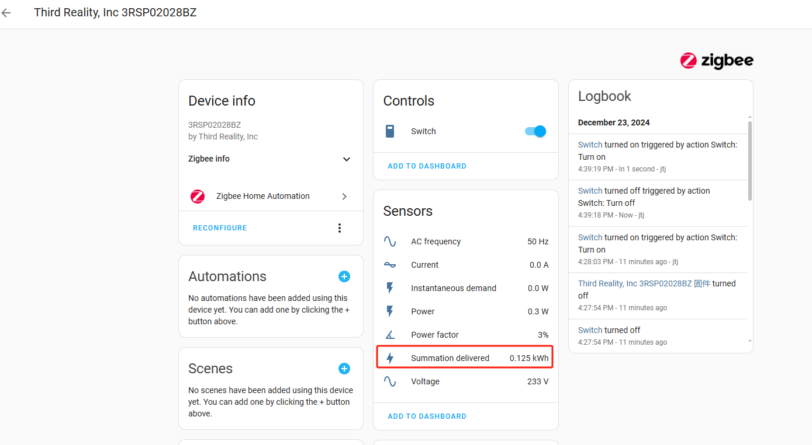
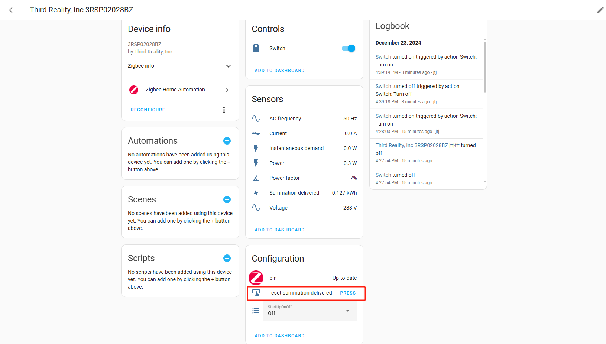
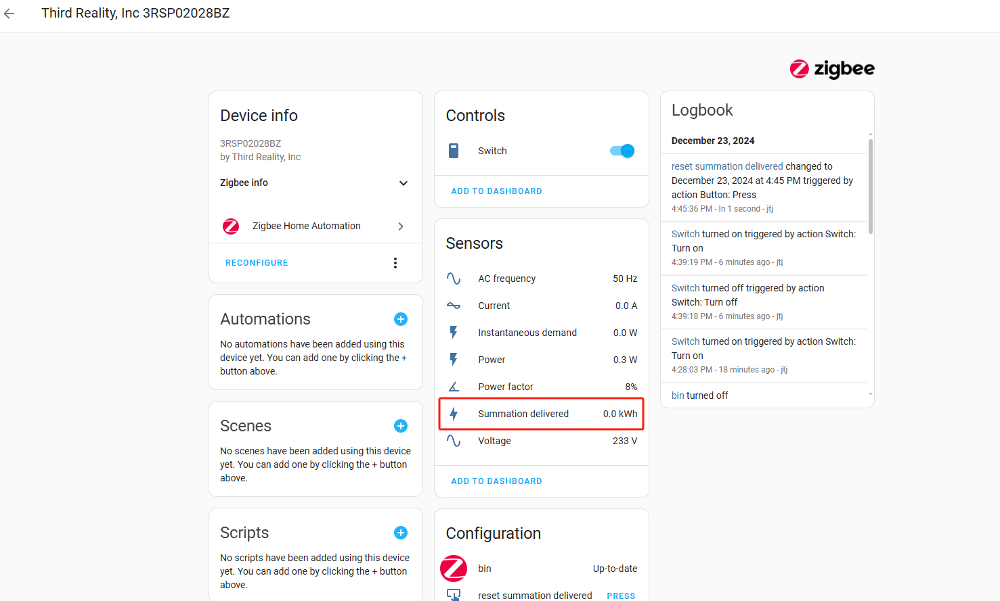

# Instructions on ThirdReality Smart Plug Private Cluster in Home Assistant ZHA（The function of reset summation delivered ）
at least Home Assistant Core is 2024.12.2
#

## 1.Operating Devices

1) Add a PLUG Device

2) Access PLUG Device Settings, navigate to the details page of the added PLUG device

3) Click the button called PRESS

4) After

