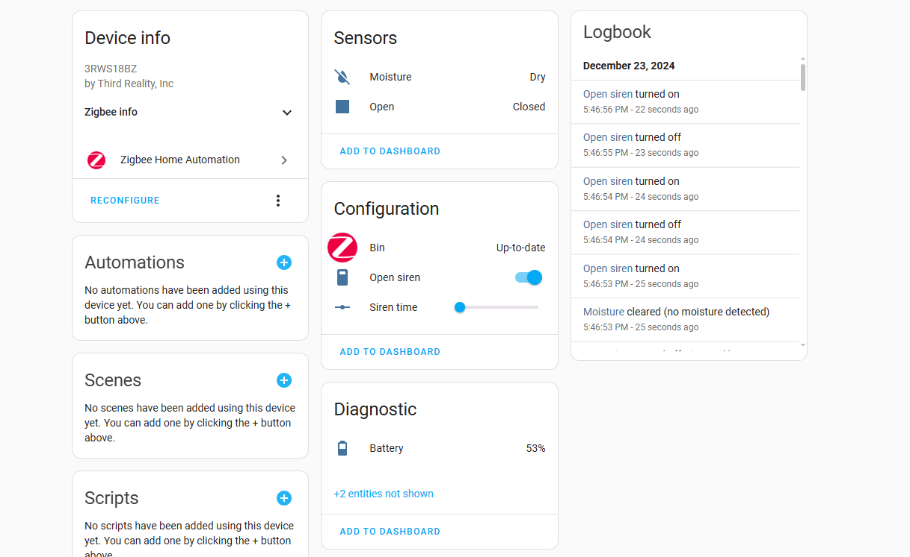
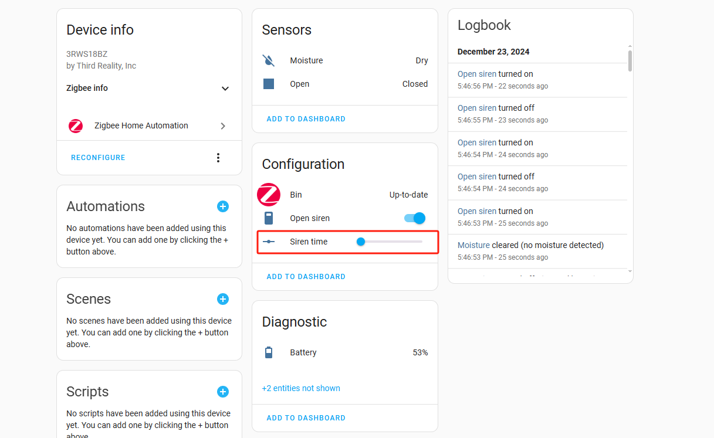

# Instructions on ThirdReality Water Leak Sensor Private Cluster in Home Assistant ZHA
at least Home Assistant Core is 2024.12.2
#

## 1.Operating Devices

1) Add a WATER LEAK SENSOR Device

2) Access WATER LEAK SENSOR Device Settings, navigate to the details page of the added WATER LEAK SENSOR device

3) Set the sounding time of the siren

4) eg.If you set Siren time is 60(the unit is seconds), from the moment it was triggered, the beep will last for 60s

