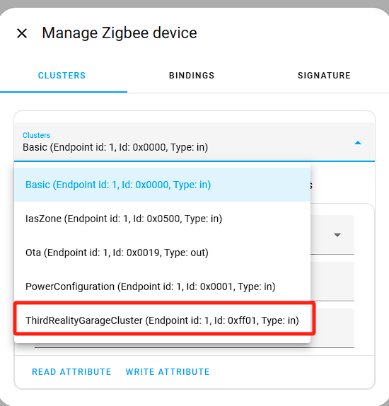
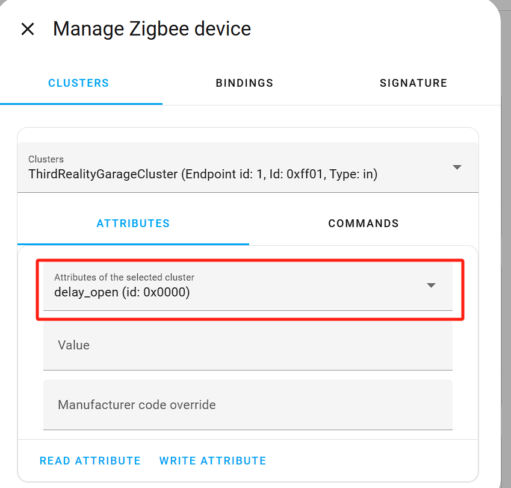
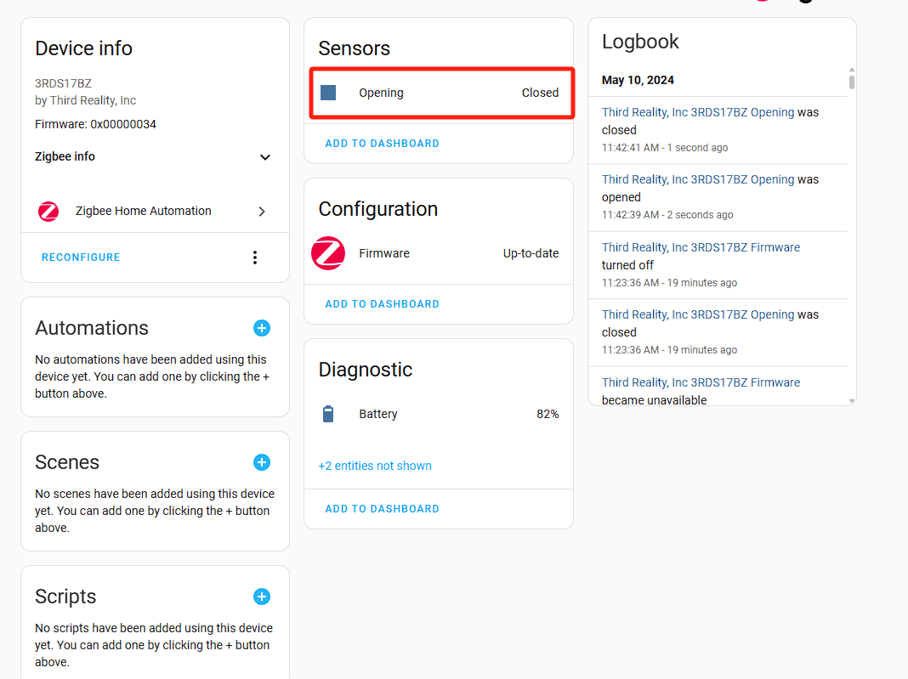
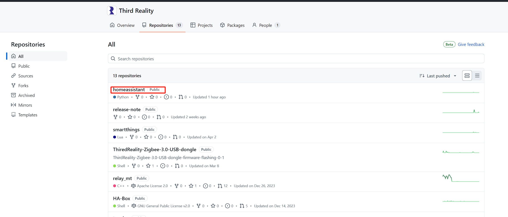
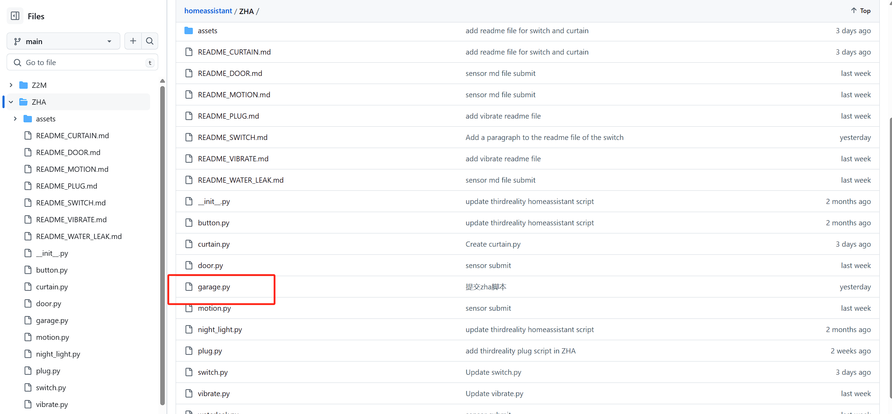

# Instructions on ThirdReality Garage Door Tilt Sensor Private Cluster in Home Assistant ZHA

#
## ZHA Configuration

1）Create a Folder for Local Code Files:
a. Navigate to the /config directory.
b. Create a new folder with a name(e.g., thirdreality_quirks). This folder will store the local code files.

2）Place the garage.py File:
a. Use the Samba share tool to transfer the garage.py file into the newly created folder.

3）Edit the configuration.yaml File(as shown in the boxed area):

4）Restart Home Assistant:
a. Restart Home Assistant to apply the configuration changes.

## Operating Devices

**Note: These instructions describe the operation for a GARAGE DOOR TILT SENSOR device. Similar methods can be applied to customize other ThirdReaity devices with private clusters.**

1) Add a GARAGE DOOR TILT SENSOR Device

2) Access GARAGE DOOR TILT SENSOR Device Settings, navigate to the details page of the added GARAGE DOOR TILT SENSOR device, click the "Options" button, as shown in the screenshot

3) In the pop-up menu, choose the "Manage Zigbee Device" option.

4) In the new window, select "ThirdRealityGarageCluster" from the "Clusters" drop-down list.

5) Under "ATTRIBUTES," locate "delay_open.", set the "value" to (0-255sec), click the "WRITE ATTRIBUTE" button

6) If the value set 15，state from closed to open needs (15+2)sec.The garage sensor has a detection time of 2 seconds, from the end of the detection time, after which it starts to count 15 seconds

## 3.Access Smart Garage scripts on GitHub

URL：https://github.com/thirdreality

