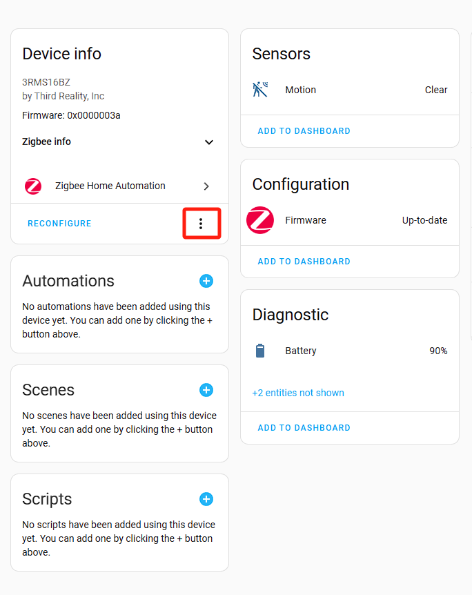
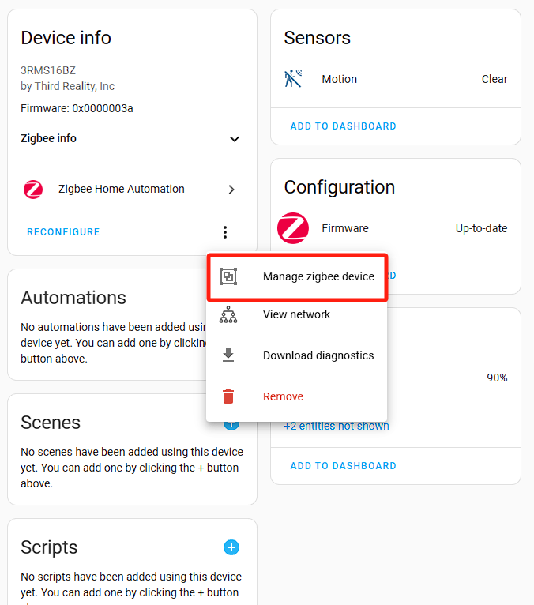
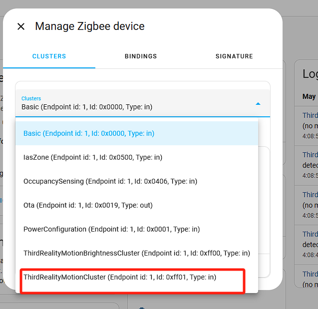
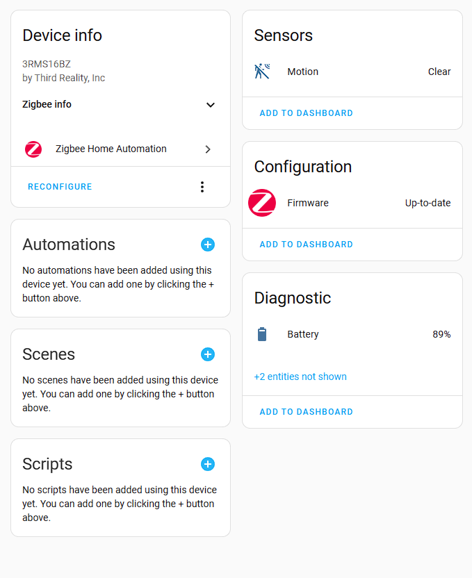
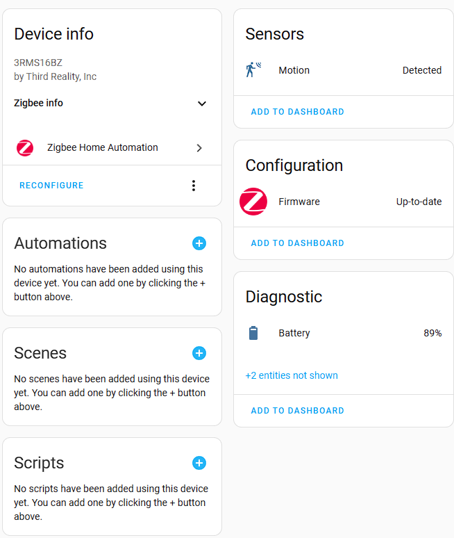

# Instructions on ThirdReality Motion Sensor Private Cluster in Home Assistant ZHA

#
## 1.ZHA Configuration

1）Create a Folder for Local Code Files:
a. Navigate to the /config directory.
b. Create a new folder with a name(e.g., thirdreality_quirks). This folder will store the local code files.

2）Place the motion.py File:
a. Use the Samba share tool to transfer the motion.py file into the newly created folder.

3）Edit the configuration.yaml File(as shown in the boxed area):

4）Restart Home Assistant:
a. Restart Home Assistant to apply the configuration changes.

## 2.Operating Devices（detected_to_undetected_delay）(The device is reset, and all private property Settings are restored to default values)

**Note: These instructions describe the operation for a MOTION SENSOR device. Similar methods can be applied to customize other ThirdReaity devices with private clusters.**

1) Add a MOTION SENSOR Device

2) Access MOTION SENSOR Device Settings, navigate to the details page of the added MOTION SENSOR device, click the "Options" button, as shown in the screenshot

3) In the pop-up menu, choose the "Manage Zigbee Device" option.

4) In the new window, select "ThirdRealityMotionCluster" from the "Clusters" drop-down list.

5) Under "ATTRIBUTES," locate "detected_to_undetected_delay.", set the "value" to (0-65535sec), click the "WRITE ATTRIBUTE" button(The default value is 30 seconds)

6) If the value set 15，state from detected to clear needs (15+4)sec.The motion sensor has a detection time of 4 seconds, from the end of the detection time, after which it starts to count 15 seconds

## 3.Operating Devices（Control the brightness of the light）(The device is reset, and all private property Settings are restored to default values)

**Note: These instructions describe the operation for a MOTION SENSOR device. Similar methods can be applied to customize other ThirdReaity devices with private clusters.**

1) Add a MOTION SENSOR Device

2) Access MOTION SENSOR Device Settings, navigate to the details page of the added MOTION SENSOR device, click the "Options" button, as shown in the screenshot

3) In the pop-up menu, choose the "Manage Zigbee Device" option.

4) In the new window, select "ThirdRealityMotionBrightnessCluster" from the "Clusters" drop-down list

5)Under "ATTRIBUTES," locate "blue_light" or "red_light", set the "value" to (0-100,    0 is the darkest, 100 is the brightest), click the "WRITE ATTRIBUTE" button.(The default value is 100)

## 4.Access Smart Motion scripts on GitHub

URL：https://github.com/thirdreality

