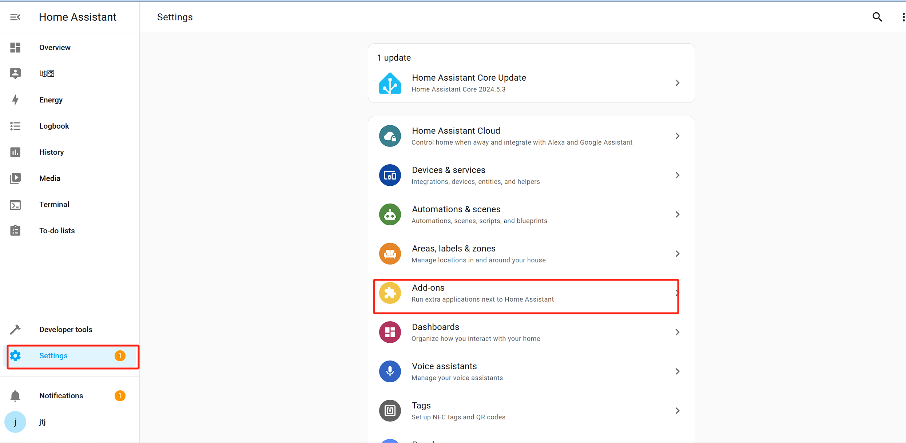
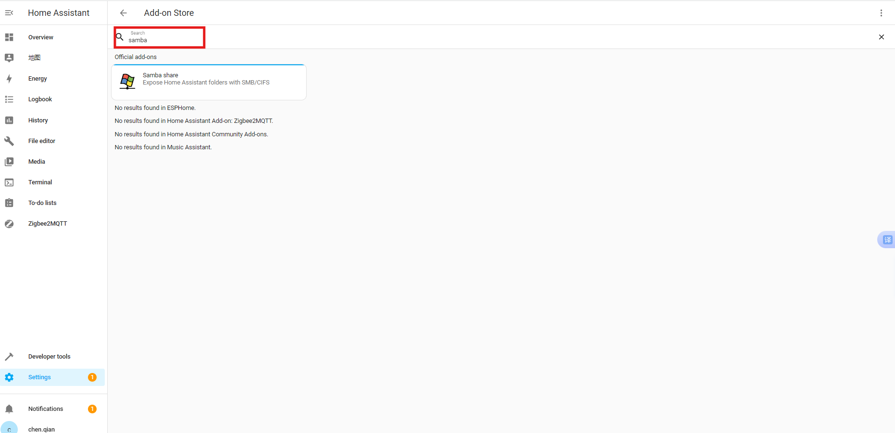
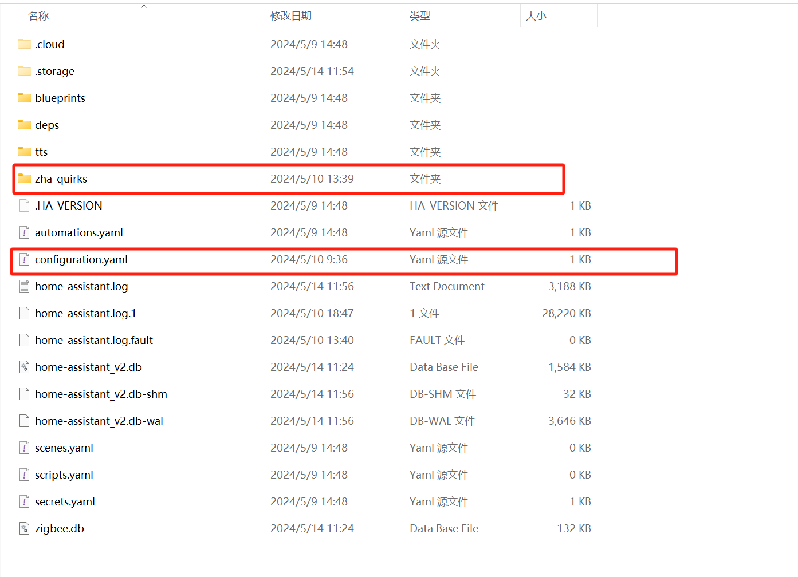

# Instructions on ThirdReality Motion Sensor Private Cluster in Home Assistant ZHA（Support zha starting from version 62）

#
## 1.ZHA Configuration And How To Add The Script 

1）Install the Samba Sahre add-on in Home Assistant

#If you cannot find the plugin, please open the advanced settings below

2）Open the folder and enter the IP address of the Home assistant. You need to enter your account and password(Account password in Samba share configuration)

3）Afterwards, enter the config file and create a new file to store the script. (My script is stored in zha_quirks)

4）Enter configuration.yaml, add these two lines, and the path will be the location where you store the plug script, as shown in the above figure

a. Restart Home Assistant to apply the configuration changes.

## 2.Operating Devices（detected to undetected delay）(The device is reset, and all private property Settings are restored to default values)

**Note: These instructions describe the operation for a MOTION SENSOR device. Similar methods can be applied to customize other ThirdReaity devices with private clusters.**

1) Add a MOTION SENSOR Device

2) Access MOTION SENSOR Device Settings, navigate to the details page of the added MOTION SENSOR device, click the "Options" button, as shown in the screenshot

3) In the pop-up menu, choose the "Manage Zigbee Device" option.

4) In the new window, select "ThirdRealityMotionCluster" from the "Clusters" drop-down list.

5) Under "ATTRIBUTES," locate "detected_to_undetected_delay.", set the "value" to (0-65535sec), click the "WRITE ATTRIBUTE" button(The default value is 30 seconds)

6) If the value set 15，state from detected to clear needs (15+4)sec.The motion sensor has a detection time of 4 seconds, from the end of the detection time, after which it starts to count 15 seconds

## 3.Operating Devices（Control the brightness of the light）(The device is reset, and all private property Settings are restored to default values)

**Note: These instructions describe the operation for a MOTION SENSOR device. Similar methods can be applied to customize other ThirdReaity devices with private clusters.**

1) Add a MOTION SENSOR Device

2) Access MOTION SENSOR Device Settings, navigate to the details page of the added MOTION SENSOR device, click the "Options" button, as shown in the screenshot

3) In the pop-up menu, choose the "Manage Zigbee Device" option.

4) In the new window, select "ThirdRealityMotionBrightnessCluster" from the "Clusters" drop-down list

5)Under "ATTRIBUTES," locate "blue_light" or "red_light", set the "value" to (0-100,    0 is the darkest, 100 is the brightest), click the "WRITE ATTRIBUTE" button.(The default value is 100)

## 4.Access Smart Motion scripts on GitHub

URL：https://github.com/thirdreality

