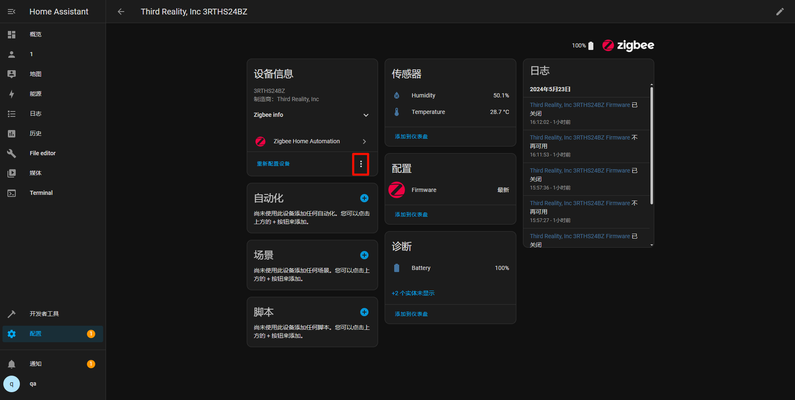
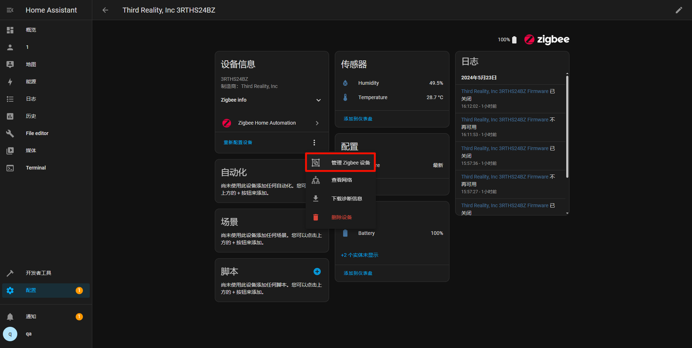
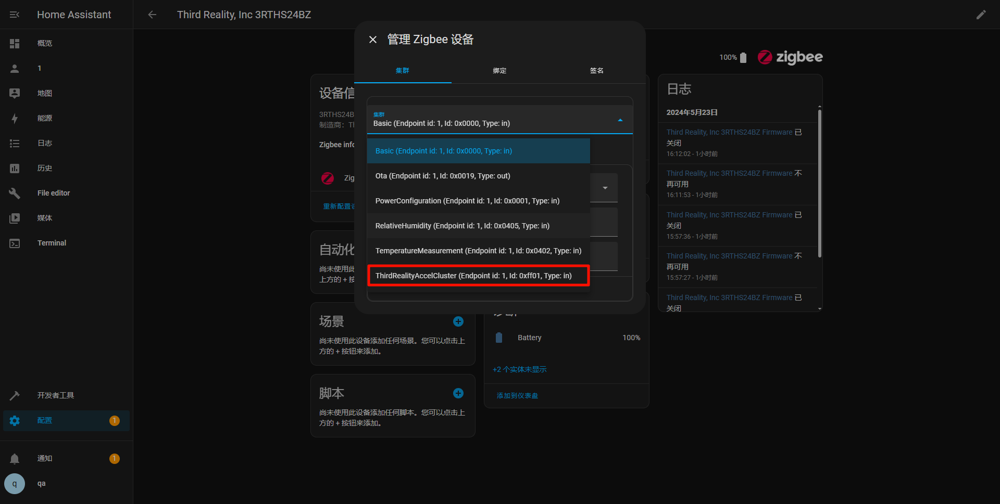
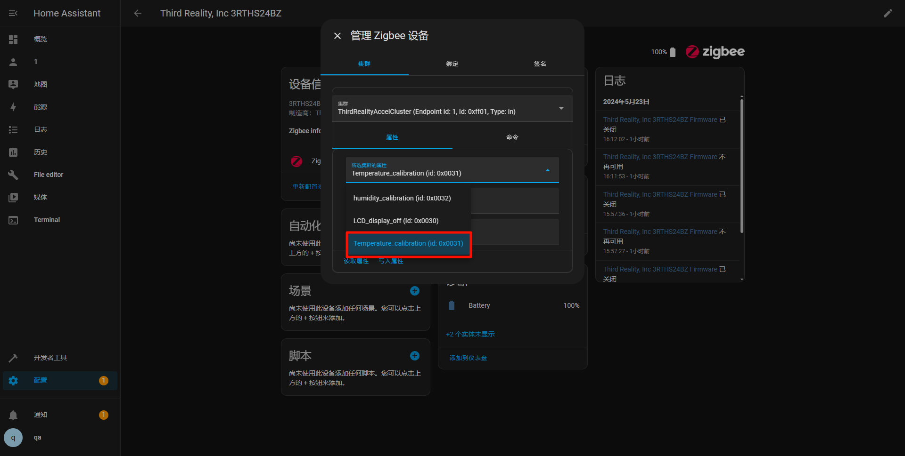
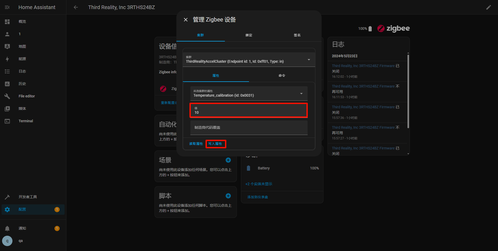
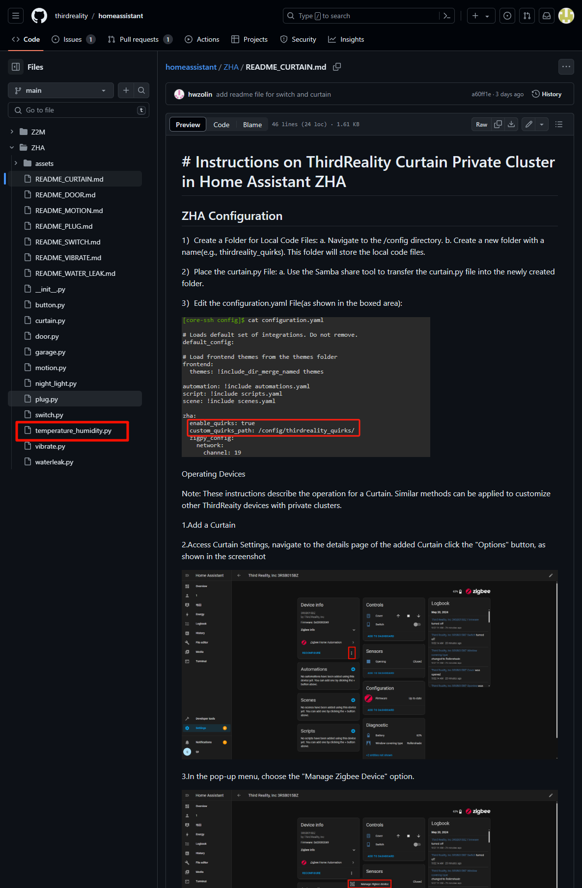

# # Instructions on ThirdReality Temperature and Humidity Private Cluster in Home Assistant ZHA

#
## 1.ZHA Configuration And How To Add The Script 

1）Install the Samba Sahre add-on in Home Assistant

#If you cannot find the plugin, please open the advanced settings below

2）Open the folder and enter the IP address of the Home assistant. You need to enter your account and password(Account password in Samba share configuration)

3）Afterwards, enter the config file and create a new file to store the script. (My script is stored in zha_quirks)

4）Enter configuration.yaml, add these two lines, and the path will be the location where you store the plug script, as shown in the above figure

a. Restart Home Assistant to apply the configuration changes.

## 2.Operating Devices

Note: These instructions describe the operation for a Temperature and Humidity. Similar methods can be applied to customize other ThirdReaity devices with private clusters.

1.Add a Temperature and Humidity

2.Access Temperature and Humidity Settings, navigate to the details page of the added Temperature and Humidity click the "Options" button, as shown in the screenshot

3.In the pop-up menu, choose the "Manage Zigbee Device" option.

4.In the new window, select "ThirdRealityAccelCluster" from the "Clusters" drop-down list.

5.Under "ATTRIBUTES," locate "Temperature_calibration", set the "value" to 10 ，click the "WRITE"(The unit is 0.1 degrees. If this value is 10, the detected value increases by 1.0 degrees. If it is -10, the detected value decreases by 1.0 degrees)

6.Under "ATTRIBUTES," locate "humidity_calibration", set the "value" to 10 ，click the "WRITE"(The unit is 0.1%. If this value is 10, add 1% to the detected value)

## 3.Access Smart Plug scripts on GitHub
URL：https://github.com/thirdreality

