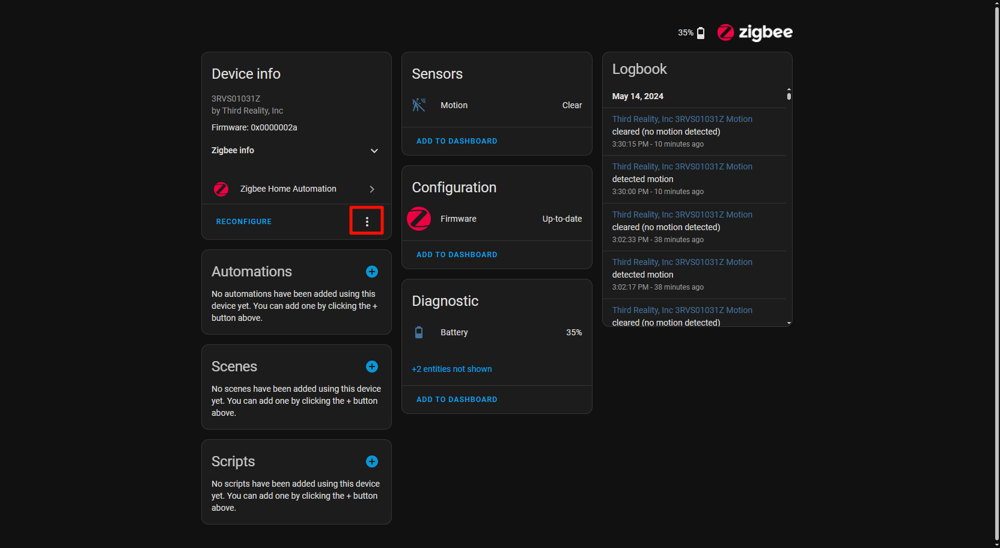
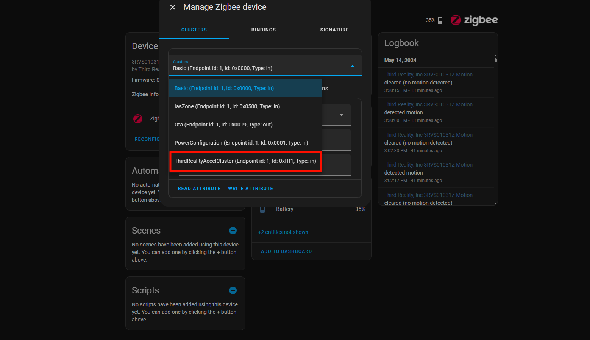

# Instructions on ThirdReality Vibration Sensor Private Cluster in Home Assistant ZHA（Support zha starting from version 46）

#
## 1.ZHA Configuration And How To Add The Script 

1）Install the Samba Sahre add-on in Home Assistant

#If you cannot find the plugin, please open the advanced settings below

2）Open the folder and enter the IP address of the Home assistant. You need to enter your account and password(Account password in Samba share configuration)

3）Afterwards, enter the config file and create a new file to store the script. (My script is stored in zha_quirks)

4）Enter configuration.yaml, add these two lines, and the path will be the location where you store the plug script, as shown in the above figure

a. Restart Home Assistant to apply the configuration changes.

## 2.Operating Devices

Note: These instructions describe the operation for a Vibration Sensor. Similar methods can be applied to customize other ThirdReaity devices with private clusters.

1.Add a Vibration Sensor

2.Access Vibration Sensor Settings, navigate to the details page of the added Vibration Sensor click the "Options" button, as shown in the screenshot

3.In the pop-up menu, choose the "Manage Zigbee Device" option.

4.In the new window, select "ThirdRealityAccelCluster" from the "Clusters" drop-down list.

5.Under "ATTRIBUTES," locate "cooldown_perioc.", set the "value" to 10, click the "WRITE ATTRIBUTE" button.

6.Compare the "Logbook" display before and after sending the command. The following two screenshots show the difference.

## 3.Access Smart Plug scripts on GitHub
URL：https://github.com/thirdreality

