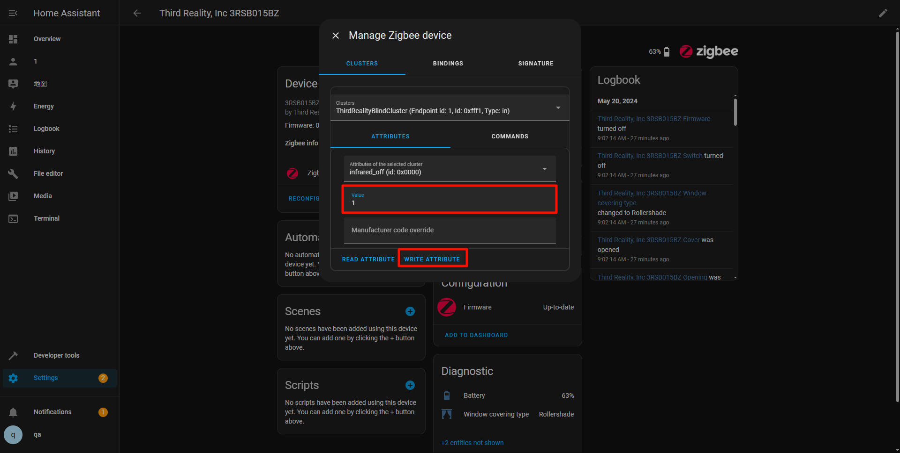

# # Instructions on ThirdReality Curtain Private Cluster in Home Assistant ZHA

## ZHA Configuration

1）Create a Folder for Local Code Files: a. Navigate to the /config directory. b. Create a new folder with a name(e.g., thirdreality_quirks). This folder will store the local code files.

2）Place the curtain.py File: a. Use the Samba share tool to transfer the curtain.py file into the newly created folder.

3）Edit the configuration.yaml File(as shown in the boxed area):

Operating Devices

Note: These instructions describe the operation for a Curtain. Similar methods can be applied to customize other ThirdReaity devices with private clusters.

1.Add a Curtain

2.Access Curtain Settings, navigate to the details page of the added Curtain click the "Options" button, as shown in the screenshot

3.In the pop-up menu, choose the "Manage Zigbee Device" option.

4.In the new window, select "ThirdRealityBlindCluster" from the "Clusters" drop-down list.

5.Under "ATTRIBUTES," locate "infrared_off", set the "value" to 1, click the "WRITE ATTRIBUTE" button.

3.Access Smart Plug scripts on GitHub
URL：https://github.com/thirdreality

